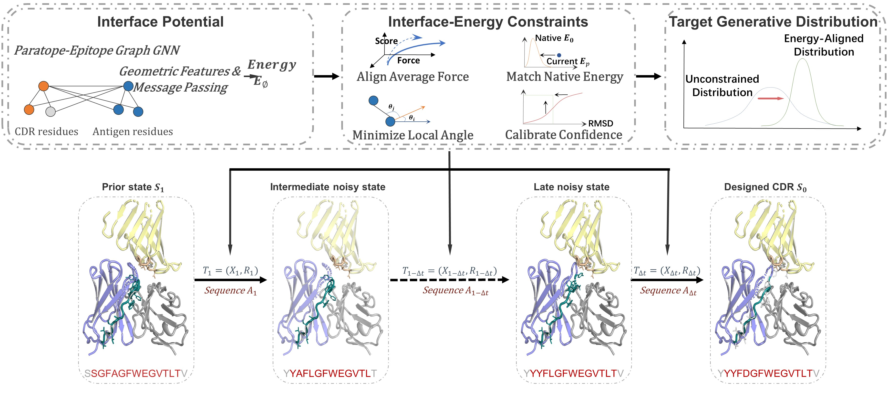

# AbEIP: Fokker-Planck-informed constraints on score-based diffusion for antibody design




## Installation

### Setting up the AbEIP Environment

To install AbEIP, it is recommended to create a Conda environment and install the necessary dependencies by following these steps:

```bash
conda env create -f environment.yml
```

PyRosetta is required to relax the generated structures and compute binding energy. Please refer to the installation guide provided [here](https://www.pyrosetta.org/) for further instructions.

### Dataset Preparation

Antibody-antigen structures and associated summary files can be retrieved from the SAbDab database. The dataset and accompanying files can be downloaded from the following links: 
- [Dataset](https://opig.stats.ox.ac.uk/webapps/sabdab-sabpred/sabdab/archive/all/)
- [Summary Files](https://opig.stats.ox.ac.uk/webapps/sabdab-sabpred/sabdab/summary/all/)

Extract `all_structures.zip` into the `data` directory.

To preprocess the structure data into `.npz` format, use the `preprocess_data.py` script:

```bash
python preprocess_data.py --cpu 100 --summary_file ./data/sabdab_summary_all.tsv --data_dir ./data/pdb --output_dir ./data/npz --data_mode pdb
```

We recommend using the `pdb` format for PDB structures, as it provides comprehensive information.

### Pre-trained Models

We provide two pre-trained checkpoints:

1. **AbEIP_h3** (model trained for epitope-binding CDR-H3 design)  
   - Download from Google Drive:  
     https://drive.google.com/file/d/19ebTZQl0Jd4TikwQpK6Lkbw26y-moksE/view?usp=drive_link 
   - Save as: `./trained_model/AbEIP_h3.ckpt`  
   - Used together with `config/config_data_feature.json`.

2. **AbEIP_6cdr** (model trained for six-CDR co-design)  
   - Download from Google Drive:  
      https://drive.google.com/file/d/1FZ9h2K8M1u38VL-FGUFNv6hVKvJn7bja/view?usp=drive_link  
   - Save as: `./trained_model/AbEIP_6cdr.ckpt`  
   - Used together with `config/config_data_feature_cdr.json`.

In addition, download the following external weights:

- **ESM2** model weights:  
  https://dl.fbaipublicfiles.com/fair-esm/models/esm2_t33_650M_UR50D.pt  
- **Contact regressor** weights:  
  https://dl.fbaipublicfiles.com/fair-esm/regression/esm2_t33_650M_UR50D-contact-regression.pt  

Save these files into the `./trained_model` directory.


## Usage Instructions

### Training

To train AbEIP, use the provided launcher script `train_ema.sh` together with a JSON config file:

```bash
GPU=0 bash train_ema.sh config/train_ema.json
```

### Co-Design of CDRs in the RAbD Test Dataset

We provide two pre-trained models: one for epitope-binding CDR-H3 design and one for six-CDR co-design.  
Use the corresponding checkpoint and feature config as follows.

#### CDR-H3 design

```bash
CUDA_VISIBLE_DEVICES=0 python inference.py  \
    --model ./trained_model/AbEIP_h3.ckpt \
    --model_features ./config/config_data_feature.json \
    --model_config ./config/config_model.json \
    --batch_size 1 \
    --num_samples 100 \
    --name_idx ./test_data/RAbD_test.idx \
    --data_dir  ./data/npz \
    --output_dir ./output/RAbD_H3_design \
    --mode design
```
#### Six-CDR co-design
```bash
CUDA_VISIBLE_DEVICES=0 python inference.py  \
    --model ./trained_model/AbEIP_6cdr.ckpt \
    --model_features ./config/config_data_feature_cdr.json \
    --model_config ./config/config_model.json \
    --batch_size 1 \
    --num_samples 100 \
    --name_idx ./test_data/RAbD_test.idx \
    --data_dir  ./data/npz \
    --output_dir ./output/RAbD_6CDR_design \
    --mode design
```


### CDR Optimization in RAbD Test Dataset

To optimize CDRs in the RAbD test dataset, run the following command:

```bash
CUDA_VISIBLE_DEVICES=0 python inference.py  \
    --model ./trained_model/AbEIP_h3.ckpt \
    --model_features ./config/config_data_feature.json \
    --model_config ./config/config_model.json \
    --batch_size 1 \
    --num_samples 100 \
    --name_idx ./test_data/RAbD_test.idx \
    --data_dir  ./data/npz \
    --output_dir ./output/RAbD_optimize \
    --mode optimize
```

Modify the `generate_area` and `optimize_steps` parameters to adjust the target regions and optimization steps.


### Design CDRs given Antibody-Antigen Complex

To generate CDRs of given antibody-antigen complexes in the PDB format, use the following:

```bash
CUDA_VISIBLE_DEVICES=0 python design.py  \
    --model ./trained_model/AbEIP_h3.ckpt \
    --model_features ./config/config_data_feature.json \
    --model_config ./config/config_model.json \
    --batch_size 1 \
    --num_samples 100 \
    --pdb_file  ./test_data/6ct7_H_L_S.pdb \
    --output_dir ./output/design \
    --mode design
```

The example of input antibody-antigen complexes is `6ct7_H_L_S.pdb`, where `H` is the heavy chain id, `L` is the light chain id and `S` is the antigen chain id.


### Relaxing the Designed Proteins

To relax the designed proteins using PyRosetta, run the following command and modify the relaxation regions using the `generate_area` parameter:

```bash
CUDA_VISIBLE_DEVICES=0 python relax_pdb.py  \
    --input_dir ./output/output_dir \
    --cpus 100 \
    --generate_area cdrs
```

### Metric Calculation

To compute the RMSD, AAR, and IMP metrics, use the `eval_metric.py` script as follows:

```bash
CUDA_VISIBLE_DEVICES=0 python eval_metric.py  \
    --data_dir ./output/output_dir \
    --cpus 100 \
    --energy
```

### Reproducing paper metrics

- **Table 1 (Epitope-binding CDR-H3 design)**  
  All metrics (AAR, TM-score, lDDT, CAAR, RMSD, DockQ) are computed using the
  official [dyMEAN](https://github.com/THUNLP-MT/dyMEAN) evaluation scripts, following exactly the protocol described
  in their paper.

- **Table 2 (Per-CDR performance)**  
  Per-CDR AAR and RMSD are computed with our evaluation script
  `eval_metric.py` in this repository.

- **Table 3 (CDR-H3 optimization trajectories)**  
  IMP, AAR and RMSD are computed with `eval_metric.py`.  
  DockQ is computed using the dyMEAN docking and evaluation pipeline.

- **Table 4 (Ablation study)**  
  IMP, AAR and RMSD are computed with `eval_metric.py`.  
  DockQ is computed using the dyMEAN docking and evaluation pipeline.
